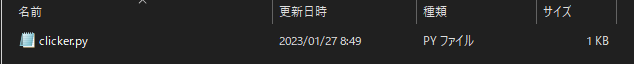
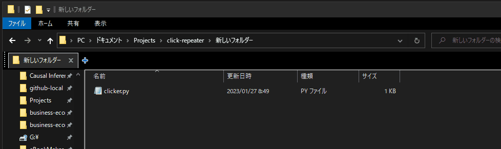

# クリック連打ツールの作り方

# 1. 事前準備
## 1-1. Pythonのインストール

公式ページ（https://www.python.org/）に行って「Downloads」から「Download for Windows」の「Python 3.11.1」をクリックし、取得した.exeファイルを実行する


## 1-2. 使用するライブラリのインストール

機能のまとまりごとにプログラムをまとめたものを**ライブラリ**（library）や**パッケージ**（package）という。やりたい目的を実現するためのすべてのプログラムを自分で書いていたら大変なので、プログラミングをする際はライブラリを使っていくことになる。

今回は [mouse](https://pypi.org/project/mouse/) と[pyinstaller](https://pypi.org/project/pyinstaller/)を使うのでインストールしておく必要がある。

pythonをインストールしたときに`pip`というパッケージ管理ツールもインストールされたはずなので、以下のコマンドをコマンドプロンプトかPowerShellで実行するとインストールできる。

```shell
pip install mouse pyinstaller
```


# 2. 開発

## 2-1. プログラム

今回使うプログラムは以下のもの。

```python
import time
import mouse
from datetime import datetime

while True:
    timestamp = datetime.now().strftime("%Y-%m-%d %H:%M:%S")
    mouse.click('right')
    print(f'[{timestamp}] clicked.')
    time.sleep(11)
```


解説のコメントをつけたのがこちら：

```python
# パッケージの読み込み
import time
import mouse  # mouseパッケージの読み込み
from datetime import datetime
# ※timeやdatetimeはpythonに標準で入っているパッケージなのでpip installは不要

# while <条件式>: 条件式がTrueであるかぎりループを続ける
while True:  # while True = 無限ループ
    # datetime.now()で現在時刻を取得 → strftime()で表示形式を整える
    timestamp = datetime.now().strftime("%Y-%m-%d %H:%M:%S")
    mouse.click('right')  # 右クリック
    print(f'[{timestamp}] clicked.')  # ログ出力
    time.sleep(11)  # 指定された秒数待つ
```


#### 補足：`while`について

今回は「11秒ごとに右クリックを行い続ける」という動作を実現したい。

普通のプログラムは上から下まで順番に実行されて終了してしまうので無限ループにして終了しないようにした。


## 2-2. プログラムの実行

上記のプログラムをメモ帳などに貼り付けて保存する。
（一般的にはpythonのコードは`.py`という拡張子にする）




このファイル（`clicker.py`という名前にしたと仮定する）を置いたディレクトリでPowerShellかコマンドプロンプトを起動し、

```sh
python3 clicker.py
```

というコマンドを実行するとpythonファイルが実行される。



終了するにはPowershellを閉じるか`ctrl + c`を押せば良い

## 2-3. `.exe` ファイル化

毎回`python3 clicker.py`とか実行するのは面倒なので、クリックで実行できるようにする。今回は`pyinstaller`パッケージを使って`.py`を`.exe`に変換することにする。

以下のコマンドをPowerShellかコマンドプロンプトで実行する。

```sh
pyinstaller --onefile clicker.py
```

すると、`build`と`dist`というディレクトリが生成され、`clicker.spec`というファイルも生成される。


`dist`の中に生成された`.exe`ファイルがある


`.exe`だけがあればいいので`build`と`.spec`ファイルは消して問題ない


